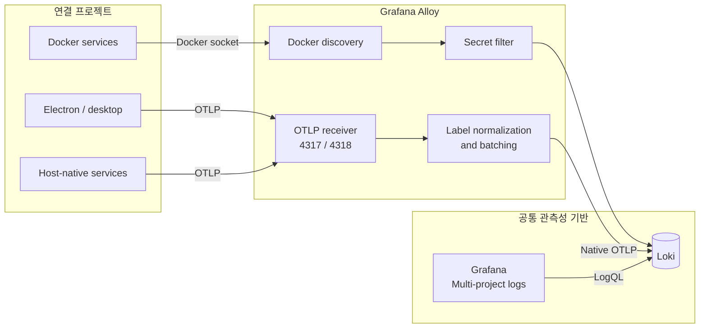

# Observability Platform

여러 애플리케이션의 로그를 한곳에서 수집하고 탐색하기 위한 공통 관측성 기반이다. Docker에서 실행되는 서비스는 자동으로 발견하고, Electron·CLI·호스트 프로세스는 표준 OTLP로 연결한다. 모든 로그는 동일한 `project / service / environment` 계약으로 정규화되어 하나의 Grafana 대시보드에서 조회된다.

## 현재 제공 범위

- Grafana로 프로젝트별 로그 현황, 오류, 활성 서비스, 최신 오류, 전체 로그 탐색
- Loki 단일 노드와 로컬 영속 볼륨
- Grafana Alloy를 통한 Docker 자동 수집과 OTLP HTTP/gRPC 수신
- Docker 로그의 비밀값 탐지·마스킹과 공통 저카디널리티 라벨
- 코드로 프로비저닝되는 데이터소스·대시보드
- 실제 OTLP 수집부터 Grafana 데이터소스까지 확인하는 smoke test
- 설정·보안·대시보드 계약을 검사하는 GitHub Actions

## 시스템 흐름



## 빠른 시작

요구 사항은 Docker Desktop과 Node.js 22 이상이다.

```bash
npm run setup
docker compose up -d
npm run smoke
```

이후 `http://127.0.0.1:3200/d/multi-project-logs`에서 대시보드를 연다. 사용자명과 무작위 생성 비밀번호는 로컬 `.env`에만 저장되며 Git에는 포함되지 않는다.

```bash
grep '^GRAFANA_ADMIN_' .env
```

기본 로컬 엔드포인트는 다음과 같다.

| 용도 | 주소 | 외부 노출 |
| --- | --- | --- |
| Grafana | `http://127.0.0.1:3200` | 없음 |
| Loki API | `http://127.0.0.1:3100` | 없음 |
| Alloy 상태 | `http://127.0.0.1:12345` | 없음 |
| OTLP gRPC | `127.0.0.1:4317` | 없음 |
| OTLP HTTP | `http://127.0.0.1:4318` | 없음 |

## 프로젝트 연결

같은 Docker 데몬에서 실행되는 Compose 프로젝트는 별도 설정 없이 자동으로 수집된다. 정확한 이름과 환경을 지정하려면 서비스에 다음 라벨을 추가한다.

```yaml
services:
  api:
    labels:
      observability.project: my-application
      observability.service: api
      observability.environment: local
```

Electron처럼 Docker 밖에서 실행되는 앱은 OTLP HTTP `http://127.0.0.1:4318/v1/logs` 또는 gRPC `127.0.0.1:4317`로 보낸다. 연결 기준과 언어별 적용 순서는 [프로젝트 연결 가이드](docs/integration.md)에 정리했다.

## 문서

- [아키텍처와 설계 결정](docs/architecture.md)
- [프로젝트 연결 가이드](docs/integration.md)
- [공통 로그 계약](docs/log-contract.md)
- [대시보드 설계](docs/dashboard.md)
- [보안과 운영 경계](docs/security.md)
- [검증과 장애 확인](docs/testing.md)

## 자주 쓰는 명령

```bash
npm test          # 계약, 민감정보, Compose 설정 검사
npm run emit      # OTLP 테스트 로그 1건 전송
npm run smoke     # 실행 중인 전체 파이프라인 검증
npm run logs      # 플랫폼 컨테이너 로그 확인
npm run down      # 컨테이너 종료, 데이터 볼륨은 보존
```

`docker compose down -v`는 저장된 Grafana·Loki 데이터를 삭제하므로 초기화가 명확히 필요할 때만 사용한다.

## 설계 기준

이 저장소는 로컬 개발과 단일 호스트 공유를 위한 출발점이다. Loki는 자체 인증 계층이 없으므로 모든 포트를 loopback에만 바인딩했다. 팀 또는 원격 운영 환경으로 확장할 때는 TLS·인증 프록시·외부 오브젝트 스토리지·백업을 먼저 추가해야 한다.

구성은 공식 문서의 [Grafana 파일 프로비저닝](https://grafana.com/docs/grafana/latest/administration/provisioning/), [Alloy Docker 로그 수집](https://grafana.com/docs/alloy/latest/monitor/monitor-docker-containers/), [Alloy OTLP 로그 파이프라인](https://grafana.com/docs/loki/latest/send-data/alloy/examples/alloy-otel-logs/), [Loki 로컬 TSDB 구성](https://grafana.com/docs/loki/latest/configure/examples/configuration-examples/)을 기준으로 한다.
