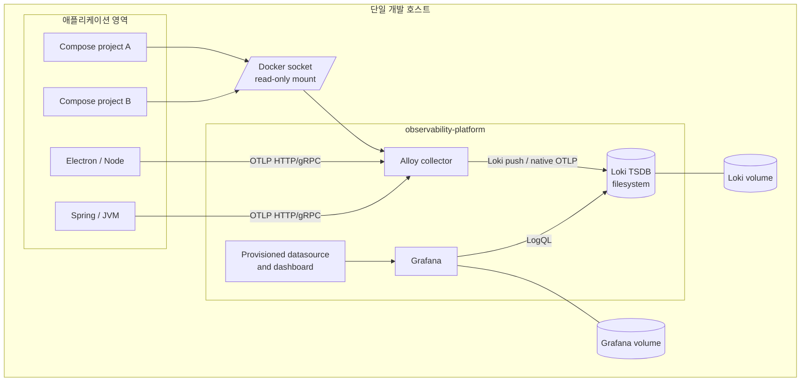
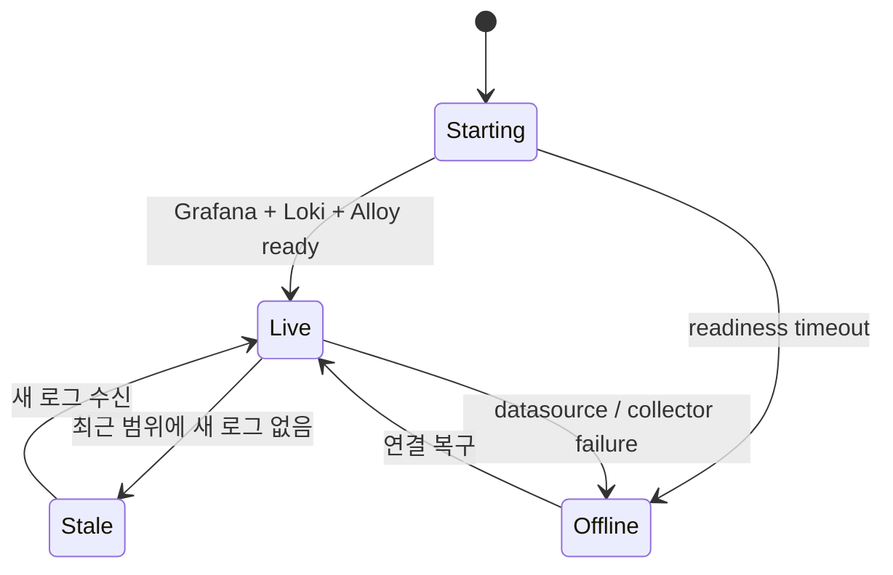

# 아키텍처와 설계 결정

## 목표

각 애플리케이션이 서로 다른 로깅 라이브러리를 사용하더라도, 운영자가 한 화면에서 프로젝트를 선택하고 서비스·환경·로그 레벨 순으로 범위를 좁혀 실패 원문까지 확인할 수 있어야 한다. 연결 방식은 Docker 메타데이터와 OpenTelemetry 표준을 경계로 삼아 애플리케이션 코드와 저장소 구현을 분리한다.

## 런타임 구성

| 컴포넌트 | 인스턴스 | 책임 | 현재 저장 방식 |
| --- | ---: | --- | --- |
| Grafana | 1 | 필터, 시각화, Explore 진입 | Docker volume |
| Loki | 1 | 라벨 인덱스와 로그 본문 저장, LogQL | TSDB + filesystem volume |
| Alloy | 1 | Docker 탐색, OTLP 수신, 정규화, 전달 | position용 Docker volume |

## 수집 경로

### Docker 경로

1. Alloy가 Docker socket에서 실행 컨테이너를 발견한다.
2. Compose의 project/service 메타데이터를 공통 라벨로 변환한다.
3. 선택적 `observability.*` 라벨이 자동값을 덮어쓴다.
4. ANSI 색상을 제거하고 대표 로그 레벨을 추출한다.
5. 비밀값 탐지 필터가 로그 본문을 마스킹한다.
6. Loki push API로 저장한다.

Alloy는 position을 저장하므로 재시작 후에도 가능한 한 읽던 위치에서 수집을 계속한다.

`observability-platform` 자체 컨테이너는 이 애플리케이션 로그 경로에서 제외한다. Grafana가 실행한 오류 검색 쿼리 문자열이 다시 오류 로그로 수집되는 피드백을 막기 위해서다. 플랫폼 상태는 readiness, smoke test, 이후 추가할 전용 metrics 대시보드에서 분리해 본다.

### OTLP 경로

1. 애플리케이션 SDK 또는 에이전트가 OTLP HTTP/gRPC로 로그를 보낸다.
2. `service.namespace`, `service.name`, `deployment.environment.name`을 각각 `project`, `service`, `environment`로 정규화한다.
3. 누락된 필드는 `unclassified`, `unknown-service`, `unknown`으로 표시해 무음 유실을 막는다.
4. 1초 또는 512건 단위로 묶어 Loki의 native OTLP endpoint로 보낸다.

## 갱신과 화면 비용

- 기본 시간 범위: 최근 1시간
- 대시보드 갱신: 5초
- 첫 화면: stat 3개, 시계열 1개, 심각도 근사 1개
- 상세 화면: 최신 오류와 전체 로그 패널
- 렌더러: Grafana 기본 패널만 사용하며 별도 프런트엔드 런타임은 없다.
- 쿼리 비용 제어: 시간 범위와 저카디널리티 라벨을 먼저 적용하고 본문 정규식은 그 다음에 평가한다.

시간 범위를 길게 잡을수록 Loki가 읽는 데이터가 늘어난다. 기본 화면은 사고 감지에 충분한 1시간을 선택하고, 과거 분석은 사용자가 명시적으로 범위를 확장한다.

## 상태 모델

- **Live:** 5초 갱신과 함께 새 데이터가 들어온다.
- **Stale:** 플랫폼은 정상이지만 선택 범위에 로그가 없다. 대시보드는 0 또는 빈 로그 상태를 보인다.
- **Offline:** Grafana 데이터소스 오류 또는 Alloy/Loki readiness 실패다. `npm run smoke`가 실패 원인을 구분한다.

## 결정과 트레이드오프

| 결정 | 이유 | 비용 / 다음 확장점 |
| --- | --- | --- |
| 단일 Loki | 로컬 개발과 여러 개인 프로젝트에 충분히 단순함 | HA가 필요하면 simple scalable 또는 microservices 모드로 전환 |
| Docker socket 자동 탐색 | 기존 프로젝트 수정 없이 바로 연결 | socket 접근 권한이 큼; 원격 운영은 socket proxy 또는 플랫폼 API 사용 |
| OTLP 병행 | Electron, JVM, 호스트 앱을 벤더 중립적으로 연결 | SDK 설정과 애플리케이션 측 redaction 필요 |
| 파일 프로비저닝 | 대시보드 변경을 Git 리뷰와 CI로 검증 | UI 수정은 재시작 시 덮어쓰므로 JSON을 원본으로 관리 |
| 세 필드만 인덱스 라벨 | 쿼리 속도와 cardinality 균형 | trace/user/request 식별자는 structured metadata로 유지 |
| Alloy secret filter | 알려진 비밀값을 수집기에서도 한 번 더 차단 | Alloy 1.18에서는 experimental이므로 버전 고정·통합 테스트로 변경을 감시 |

## 운영 환경으로 넘어가기 전

현재 구성은 loopback 전용 단일 호스트 기반이다. 원격·팀 공용 환경 전환 순서는 다음과 같다.

1. 인증 프록시와 TLS를 Loki·OTLP 앞에 둔다.
2. Loki 저장소를 S3 호환 오브젝트 스토리지로 옮기고 보존 정책을 정한다.
3. Grafana OIDC와 역할 기반 접근 제어를 설정한다.
4. Alloy를 프로젝트 호스트별 또는 클러스터별로 배치한다.
5. Loki 자체 상태를 Prometheus/Mimir로, trace를 Tempo로 확장한다.
