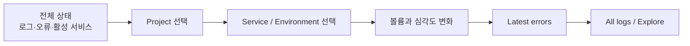

# 대시보드 설계

## 리플레이 상관 화면

`Session replay correlation` 대시보드는 리플레이 플레이어의 `View correlated logs` 동작이 여는 상세 화면이다. 리플레이가 전달한 시간 범위와 `project / service / environment / session_id`를 URL 변수로 복원하고 다음 순서로 읽는다.

1. 해당 세션의 전체 로그 수
2. 해당 세션의 오류 수
3. 시간순 전체 로그 원문

`session_id`는 사용자·요청별 고카디널리티 값이므로 Loki 인덱스 라벨로 승격하지 않는다. JSON 필드, structured metadata 또는 로그 본문에 포함하고 선택된 프로젝트·서비스·환경 범위 안에서 본문 필터로 평가한다.

## 분석 목적

대시보드는 최근 이상 징후를 빠르게 찾고, 해당 프로젝트와 서비스의 원문 로그로 내려가는 화면이다. 보고서용 요약이 아니라 반복적으로 갱신되는 운영 화면이며, 5초마다 최근 1시간을 다시 평가한다.

## 탐색 순서

## 패널 구성

| 순서 | 패널 | 질문 |
| ---: | --- | --- |
| 1 | Logs in range | 선택 범위에 로그가 실제로 들어오는가? |
| 2 | Errors in range | 실패 신호가 몇 건인가? |
| 3 | Active services | 현재 말하고 있는 서비스 수는 몇 개인가? |
| 4 | Log volume | 어느 프로젝트·서비스가 갑자기 시끄러워졌는가? |
| 5 | Severity distribution | error/warn/info 비중이 평소와 다른가? |
| 6 | Latest errors | 가장 최근 실패 원문은 무엇인가? |
| 7 | All logs | 전후 맥락과 반복 패턴은 무엇인가? |

상단 stat은 한 번의 시선으로 읽히도록 24-column 한 줄에 배치했다. 작은 화면에서는 Grafana의 반응형 레이아웃에 따라 세로로 쌓인다. Grafana의 공통 시간·변수 컨트롤 바로 다음에 상태 카드 3개가 나오고, 이후 볼륨·심각도·상세 로그 순서를 유지한다.

## 필터

- `Project`: 제품 또는 저장소 단위
- `Service`: 선택 프로젝트 내부 실행 컴포넌트
- `Environment`: local/dev/staging/prod
- `Level`: 이질적인 console log를 위한 대소문자 무시 본문 필터

Level은 모든 로그 생산자가 동일한 구조를 보장하지 않는 초기 단계의 호환 계층이다. OTLP 적용이 충분해지면 severity metadata 기반 필터로 교체한다.

## 빈 상태와 장애 상태

- 값 `0`: 선택 범위에 해당 사건이 없음
- 빈 로그 패널: 필터에 맞는 로그가 없거나 아직 수집되지 않음
- datasource error: Loki 연결 또는 LogQL 실행 실패
- smoke test failure: Grafana, Loki, Alloy, OTLP 중 실패 지점을 명령 결과로 구분

관측성 플랫폼 자체 컨테이너 로그는 애플리케이션 패널에 포함하지 않는다. 쿼리 내용이 다시 수집되는 자기 참조 노이즈를 피하고, 플랫폼 장애는 readiness와 별도 메타 모니터링으로 판단한다.

빈 상태를 임의 데이터로 채우지 않는다. 테스트 데이터가 필요할 때는 `npm run emit`으로 출처가 명확한 `smoke-emitter` 로그를 보낸다.

## 변경 규칙

Grafana UI에서 직접 수정한 내용은 원본이 아니다. `grafana/dashboards/multi-project-logs.json`을 수정하고 테스트한 뒤 커밋한다. 파일 provisioning은 대시보드를 version control에 두기 위한 Grafana 공식 지원 방식이다.
