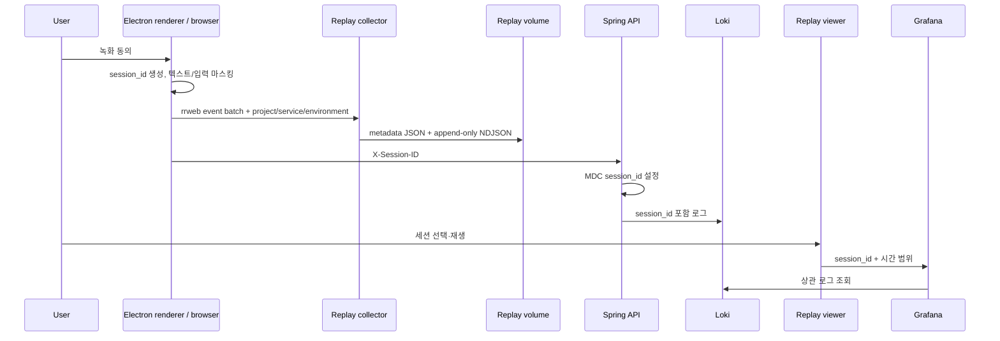

# 세션 리플레이 설계와 연결

## 범위와 provider 경계

현재 self-hosted Grafana, Alloy, Loki는 Faro 로그·오류·trace 수집은 처리하지만 리플레이 녹화 저장소와 플레이어를 제공하지 않는다. Grafana Session Replay는 Grafana Cloud Frontend Observability의 공개 프리뷰 기능이다. 이 기반은 특정 Cloud 계정 없이 로컬에서 녹화와 재생을 검증하기 위해 rrweb 수집 계층을 별도로 두고, 관측성 제품 간 결합점은 `session_id` 하나로 제한한다. 세션 카탈로그와 플레이어는 Grafana 패널이 아니라 `http://127.0.0.1:3210`의 독립 웹 애플리케이션이며, Grafana는 선택 문맥을 넘기는 진입 링크와 상관 로그 탐색만 담당한다.

Grafana Cloud Replay로 바꿀 때도 애플리케이션과 백엔드의 `session_id` 전파 계약은 유지한다. 바뀌는 부분은 브라우저 녹화 provider와 플레이어 URL뿐이다.

- [Grafana Session Replay 개요](https://grafana.com/docs/grafana-cloud/observe-and-act/monitor-applications/frontend-observability/session-replay/)
- [Grafana Session Replay 동작 방식](https://grafana.com/docs/grafana-cloud/observe-and-act/monitor-applications/session-replay/how-it-works/)
- [Grafana Faro Web SDK](https://github.com/grafana/faro-web-sdk)
- [rrweb](https://github.com/rrweb-io/rrweb)

## 설계 단위



| 단위 | 책임 | 실패 시 동작 |
| --- | --- | --- |
| Browser SDK | 동의·샘플링, DOM 변경 캡처, 마스킹, 배치 | 앱 기능은 계속 동작하고 `onError`만 호출 |
| Replay collector | 인증, Origin 제한, 크기·필드 검증, append | 잘못된 배치는 거부하고 기존 녹화 보존 |
| Replay store | 세션 metadata와 event batch 영속화 | 손상 metadata는 목록에서 제외하고 파일 보존 |
| Replay viewer | 목록·필터·검색·페이지 이동·재생·삭제·로그 이동 | 현재 URL 상태를 유지하고 연결 오류 표시 |
| Correlation dashboard | session_id가 포함된 로그 시간순 조회 | 로그가 없으면 0/빈 스트림으로 명시 |

## 화면 와이어프레임

큰 화면은 재생을 중심에 두고 목록과 진단정보를 양쪽에 배치한다.

```text
┌ Replay ───────────────────────────── Updated 14:32 ↻ ┐
├ Project ▾ Service ▾ Environment ▾ Status ▾ Search   ┤
├──────────────┬───────────────────────────┬───────────┤
│ Sessions     │ Session playback          │ Details   │
│ selected     │                           │ project   │
│ recent       │      rrweb viewport       │ service   │
│ recent       │                           │ session   │
│ [‹] 1/4 [›]  │      play · time · 1x     │ [logs]    │
└──────────────┴───────────────────────────┴───────────┘
```

모바일 portrait에서는 필터 → 재생 → 세션 목록 → 상세 순으로 바뀐다. 필터는 2열로 접고 검색은 전체 너비를 사용해 가로 스크롤 없이 project/service/environment/status/search를 모두 노출한다. 필수 값은 hover 없이 보이며 새로고침은 44px 터치 영역을 사용한다.

## 로컬 확인

```bash
npm run setup
docker compose up -d --build
```

1. `.env`에서 `REPLAY_VIEWER_USERNAME`, `REPLAY_VIEWER_PASSWORD`를 로컬로 확인한다.
2. `http://127.0.0.1:3210/demo.html`을 열고 인증한다.
3. `Add sample issue`를 누른 뒤 탭을 닫거나 다른 페이지로 이동해 batch를 완료한다.
4. `http://127.0.0.1:3210`에서 세션을 선택해 재생한다.
5. `View correlated logs`로 Grafana 상세 화면이 같은 세션 ID를 받는지 확인한다.

## 목록 조회 계약

Grafana의 `Replay catalog` 패널과 상단 `Browse replay sessions` 링크는 현재 `project / service / environment / session_id / from / to`를 독립 viewer URL에 전달한다. Viewer는 Grafana의 `var-*` 형식과 자체 URL 형식을 모두 받아 다음 API로 정규화한다. 필터·검색·페이지 상태는 viewer URL에 남으므로 새로고침과 링크 공유 뒤에도 같은 목록을 복원한다.

```http
GET /api/v1/replays?project=mylinear&service=electron-renderer&environment=local&status=completed&q=issue&page=2&pageSize=10&from=now-1h&to=now
```

- 검색 대상: `sessionId`, project, service, environment, status
- 시간 판정: 세션 구간이 `from..to`와 겹치는지 확인
- 페이지 크기: 10, 20, 50 UI 선택; API 최대 100
- 응답: 현재 page의 sessions, 전체 total/totalPages, 이전·다음 여부, 필터 facet
- 저장소: 기존 metadata JSON과 event NDJSON을 유지하며 목록 API만 서버 측으로 자른다. 따라서 S3 없이 현재 Docker volume에서 동작한다.

## Browser / Electron renderer 연결

로컬 개발에서는 플랫폼이 제공하는 ESM 번들을 허용된 Origin에서 가져올 수 있다. 배포 빌드는 `replay/src/recorder.js`를 애플리케이션 번들에 포함하는 편이 안정적이다.

```js
import {
  createReplayHeaders,
  startSessionReplay,
} from "http://127.0.0.1:3210/assets/replay-recorder.js";

const replay = startSessionReplay({
  endpoint: "http://127.0.0.1:3210",
  project: "mylinear",
  service: "electron-renderer",
  environment: "local",
  enabled: settings.sessionReplayEnabled,
  consent: settings.sessionReplayConsent,
  samplingRate: 0.1,
  ingestKey: await window.desktopSecrets.replayIngestKey(),
  onError: (error) => console.warn("Replay upload unavailable", error),
});

await fetch("http://127.0.0.1:8080/api/issues", {
  headers: createReplayHeaders(replay.sessionId),
});
```

Electron의 `file://` renderer는 Origin이 `null`이므로 로컬 `.env`의 `REPLAY_ALLOWED_ORIGINS`에 `null`을 명시했다. 원격 운영에서는 renderer가 수집 키를 직접 읽게 하지 않고 preload IPC가 batch를 main process로 넘기도록 `sendBatch` 콜백을 구현한다.

## Kotlin Spring의 session_id 전파

요청 헤더의 ID를 MDC에 넣으면 현재 console 수집 경로에서도 로그 본문으로 상관 조회할 수 있다.

```kotlin
@Component
class SessionIdFilter : OncePerRequestFilter() {
    override fun doFilterInternal(
        request: HttpServletRequest,
        response: HttpServletResponse,
        filterChain: FilterChain,
    ) {
        val sessionId = request.getHeader("X-Session-ID")
            ?.takeIf { it.matches(Regex("[A-Za-z0-9_-]{8,80}")) }

        try {
            sessionId?.let { MDC.put("session_id", it) }
            filterChain.doFilter(request, response)
        } finally {
            MDC.remove("session_id")
        }
    }
}
```

Logback 패턴 또는 JSON encoder에는 `session_id`를 포함한다. `session_id`는 Loki 라벨로 만들지 않는다.

```xml
<property name="CONSOLE_LOG_PATTERN"
          value="%d{ISO8601} %-5level [%thread] %logger session_id=%X{session_id:-none} - %msg%n" />
```

## 녹화 정책

| 항목 | 기본값 | 이유 |
| --- | ---: | --- |
| 명시적 동의 | 필수 | 사용자가 모르는 화면 수집 방지 |
| session sampling | 10% | 저장량·브라우저 비용 제한 |
| 전체 입력값 마스킹 | 켜짐 | 자격증명·개인정보 보호 |
| 전체 텍스트 마스킹 | 켜짐 | 이슈 본문·사용자 데이터 보호 |
| 캔버스 캡처 | 꺼짐 | 민감 픽셀·CPU 비용 방지 |
| 비활성 일시정지 | 60초 | 무의미한 idle 녹화 방지 |
| 업로드 | 100 event 또는 5초 | 손실 범위와 네트워크 호출 균형 |
| 보존 | 7일 | 로컬 디스크와 민감 데이터 최소화 |

화면 일부를 진단에 노출해야 할 때 전체 마스킹을 먼저 해제하지 않는다. 필요한 요소만 선택적으로 허용하고, 비밀번호·토큰·결제·메시지 영역은 `data-replay-block` 또는 `.replay-block`으로 계속 제외한다.

## 다음 운영 단계

1. Basic 인증을 OIDC reverse proxy와 프로젝트별 RBAC로 교체한다.
2. replay volume을 암호화된 오브젝트 스토리지와 lifecycle 정책으로 이전한다.
3. 사용자·조직별 동의 증적과 삭제 요청 API를 연결한다.
4. 오류 세션 우선 sampling처럼 server-driven 정책을 추가한다.
5. Grafana Cloud Replay를 채택하면 Faro ReplayInstrumentation adapter를 추가하고 동일 `session_id` 계약으로 전환한다.
