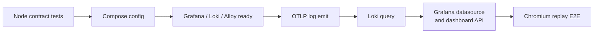

# 검증과 장애 확인

## 세션 리플레이 E2E

`npm run e2e`는 실제 Chromium에서 다음 흐름을 검증한다.

```text
demo DOM 로드 → 녹화 시작 → DOM 변경 → batch 저장 → viewer 이동
→ session 검색 → iframe 재생 → 원문 마스킹 → Grafana session_id 링크
→ 390×844 모바일 순서와 가로 넘침 확인 → 세션 정리
```

인증정보는 커밋된 설정이 아니라 `npm run setup`이 생성한 `.env`에서 읽는다. CI도 매 실행마다 새 값을 만든다. 실패 시에만 Playwright screenshot과 trace를 남기며 정상 실행에서는 녹화 데이터를 삭제한다.

## 검증 계층



### 정적·계약 테스트

```bash
npm test
```

다음을 검사한다.

- 대시보드 패널 순서, 고유 ID, 24-column 첫 줄
- 모든 쿼리의 project/service/environment 범위
- Docker·OTLP 공통 라벨 계약
- loopback port binding
- Docker secret filter 경유
- 추적 파일의 민감정보 패턴과 `.env` 제외
- Docker Compose 구문
- replay 동의·마스킹·샘플링·inactivity 계약
- replay API 인증·Origin·payload·retention 계약
- session_id correlation dashboard 계약

### 통합 smoke test

```bash
npm run setup
docker compose up -d
npm run smoke
```

검증 순서는 다음과 같다.

1. Grafana `/api/health`
2. Loki `/ready`
3. Alloy `/-/ready`
4. OTLP HTTP 로그 전송
5. Loki LogQL API에서 동일 marker 조회
6. Grafana Loki datasource health
7. provisioned log·session correlation dashboard UID 조회
8. replay batch 수집과 인증 조회
9. smoke replay 정리

## GitHub Actions

push와 pull request마다 로컬 설정을 임시 생성하고 정적·통합·Chromium E2E 검증을 모두 실행한다. 실패 시 네 컨테이너 로그를 출력하고, 성공 여부와 관계없이 volume까지 정리한다. CI의 `.env`와 비밀번호는 runner 내부에서만 생성되며 artifact로 업로드하지 않는다.

## 장애 분기

| 증상 | 먼저 확인 | 의미 |
| --- | --- | --- |
| Grafana 접속 실패 | `docker compose ps`, Grafana log | port 충돌 또는 시작 실패 |
| datasource error | Loki `/ready`, Grafana datasource API | Loki 미준비 또는 provisioning 오류 |
| Docker 로그만 없음 | Alloy UI의 Docker component, socket mount | discovery 또는 권한 문제 |
| OTLP 로그만 없음 | 4318 응답, Alloy transform/exporter | resource 또는 exporter 문제 |
| label은 있으나 화면이 비어 있음 | 시간 범위와 Level=All | dashboard filter 문제 |
| 일부 log line 누락 | secretfilter metrics와 timeout | 보안 필터가 line을 폐기했을 가능성 |
| replay 녹화가 시작되지 않음 | enabled·consent·sampling, browser console | 동의/정책 비활성 또는 SDK import 실패 |
| replay upload 403 | Origin allowlist, ingest key | Electron `null` Origin 또는 키 불일치 |
| replay는 있으나 log가 없음 | X-Session-ID와 Spring MDC | session_id 전파 또는 log pattern 누락 |

실패 재현 시 먼저 `npm run smoke`로 플랫폼 자체를 분리하고, 그 다음 연결 프로젝트 로그 설정을 확인한다.
