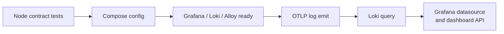

# 검증과 장애 확인

## 검증 계층



### 정적·계약 테스트

```bash
npm test
```

다음을 검사한다.

- 대시보드 패널 순서, 고유 ID, 24-column 첫 줄
- 모든 쿼리의 project/service/environment 범위
- Docker·OTLP 공통 라벨 계약
- loopback port binding
- Docker secret filter 경유
- 추적 파일의 민감정보 패턴과 `.env` 제외
- Docker Compose 구문

### 통합 smoke test

```bash
npm run setup
docker compose up -d
npm run smoke
```

검증 순서는 다음과 같다.

1. Grafana `/api/health`
2. Loki `/ready`
3. Alloy `/-/ready`
4. OTLP HTTP 로그 전송
5. Loki LogQL API에서 동일 marker 조회
6. Grafana Loki datasource health
7. provisioned dashboard UID 조회

## GitHub Actions

push와 pull request마다 로컬 설정을 임시 생성하고 정적·통합 검증을 모두 실행한다. 실패 시 세 컨테이너 로그를 출력하고, 성공 여부와 관계없이 volume까지 정리한다. CI의 `.env`와 비밀번호는 runner 내부에서만 생성되며 artifact로 업로드하지 않는다.

## 장애 분기

| 증상 | 먼저 확인 | 의미 |
| --- | --- | --- |
| Grafana 접속 실패 | `docker compose ps`, Grafana log | port 충돌 또는 시작 실패 |
| datasource error | Loki `/ready`, Grafana datasource API | Loki 미준비 또는 provisioning 오류 |
| Docker 로그만 없음 | Alloy UI의 Docker component, socket mount | discovery 또는 권한 문제 |
| OTLP 로그만 없음 | 4318 응답, Alloy transform/exporter | resource 또는 exporter 문제 |
| label은 있으나 화면이 비어 있음 | 시간 범위와 Level=All | dashboard filter 문제 |
| 일부 log line 누락 | secretfilter metrics와 timeout | 보안 필터가 line을 폐기했을 가능성 |

실패 재현 시 먼저 `npm run smoke`로 플랫폼 자체를 분리하고, 그 다음 연결 프로젝트 로그 설정을 확인한다.
